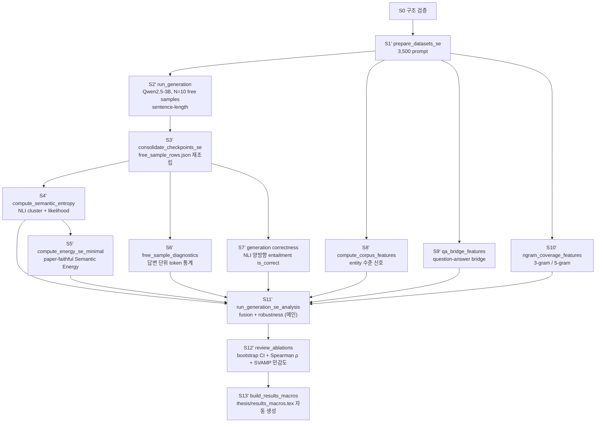

# 실험 전체 개관

이 문서는 처음 저장소를 보는 사람이 실험 목표, 데이터셋, 단계별 산출물, 검증 모듈을 한 번에 이해하도록 만든 안내서이다. 실행 계약의 source of truth 는 `experiments/PIPELINE.md` 의 트랙 B (SE 5-dataset Single-candidate) 절이다. 본 논문 메인 평가는 답변 단위 NLI 정답성 위에서 수행한다.

## 1. 문제와 논지

이 논문은 RAG 시스템 논문이 아니라 **환각 탐지 신호의 단위별 분리력 분해 분석** 을 다루는 논문이다. 질문은 다음과 같다.

> 답변에 등장하는 entity 가 corpus 안에서 얼마나 등장하는지 (entity 빈도 / entity 쌍 동시 등장 / question-answer bridge / n-gram 등장 빈도) 에 따라 Semantic Entropy 와 Semantic Energy 의 분리력이 어느 폭으로 달라지는가? corpus 신호의 단위에 따라 그 변동 폭이 달라지는가?

따라서 corpus 신호는 정답성의 직접 증거가 아니다. QuCo-RAG 에서 entity frequency 와 co-occurrence 가 high-uncertainty retrieval 상황을 찾는 데 쓰였다는 직관을 가져오되, 여기서는 retrieval 정책이 아니라 **신호의 분리력을 단위별로 분해하는 conditioning axis** 로 사용한다.

핵심 논지는 세 가지다.

1. 답변 단위 NLI 정답성은 Farquhar 등 (2024) Semantic Entropy 와 Ma 등 (2025) Semantic Energy 와 동일한 평가 단위이며, 두 선행 연구와 직접 비교 가능하다.
2. Semantic Entropy 와 Semantic Energy 는 원 논문 방식에 맞춰 구현한 뒤, sample 을 corpus 신호별 10분위로 나눠 구간별 AUROC 를 측정해야 그 분리력의 조건부 변동을 드러낼 수 있다.
3. 단위가 다른 corpus 신호 (entity 빈도, entity 쌍 동시 등장, question-answer bridge, n-gram) 의 AUROC range Δ 를 비교하면, 어떤 단위의 corpus 신호가 환각 탐지 신호의 분리력을 가장 크게 분해하는지 확인할 수 있다.

## 2. 평가 프로토콜: 답변 단위 NLI 정답성

휴리스틱 매칭과 LLM-as-judge 를 모두 배제하기 위해 **NLI 양방향 함의 매칭** 을 사용한다. 모델이 자유 생성한 답변을 데이터셋 정답 후보 (정답 표현, 동의 표현, 별칭 목록) 와 양방향 함의 확률 ≥ 0.5 로 매칭한 결과를 `is_correct` 로 정의한다.

- 한 sample 당 자유 생성 답변 10개를 산출한다.
- 각 답변마다 NLI 모델 (`microsoft/deberta-large-mnli`) 로 정답 후보와의 양방향 함의 확률을 측정한다.
- $M(s_i) = \max_{c \in C} \max(p(c \to s_i), p(s_i \to c)) \geq 0.5$ 이면 `is_correct = 1`, 그렇지 않으면 0.
- 모델이 답변을 생성하므로 candidate-level paired 라벨 (`is_hallucination`) 은 산출하지 않는다 (paired hallucinated candidate 가 데이터셋에 존재하지 않음).
- 본 평가 단위는 Farquhar 등 (2024) Semantic Entropy 와 Ma 등 (2025) Semantic Energy 의 generation-level correctness 와 동일하다.

## 3. 실험 데이터셋

| Dataset | HF id | Split | Sample count | 정답 후보 출처 |
| --- | --- | --- | ---: | --- |
| TriviaQA | `trivia_qa` (`rc.nocontext`) | validation | 800 | `answer.value` + `answer.aliases` |
| SQuAD-1.1 | `rajpurkar/squad` | validation | 800 | `answers.text` |
| BioASQ | `kroshan/BioASQ` | train | 800 | `<answer>...<context>` 파서 |
| NQ-Open | `nq_open` | validation | 800 | `answer` (alias 목록) |
| SVAMP | `ChilleD/SVAMP` | test | 300 | `Answer` (수치) |

총 sample 3,500. 자유 생성 답변 10개 × 3,500 = **35,000 generation**. 각 sample 마다 데이터셋이 제공한 정답 표현 (단일 ground-truth 또는 alias 목록) 을 정답 후보로 사용한다.

본 데이터셋은 Farquhar (Nature 2024) Semantic Entropy 와 Ma (2025) Semantic Energy 의 평가셋과 동일하다. Context passage 는 모든 데이터셋에서 의도적으로 제외한다 (Farquhar §Methods — confabulation 유도). prompt template 은 ``Answer the following question in a single brief but complete sentence.'' 의 sentence-length 시나리오를 따른다.

## 4. 한눈에 보는 파이프라인

`experiments/PIPELINE.md` 의 트랙 B 와 일치한다.



실행 (각 명령은 `$RUN` 을 산출물 root, `qwen` 을 모델 디렉터리로 가정):

```bash
uv sync --group generation
uv run python experiments/scripts/prepare_datasets_se.py --config experiments/configs/datasets_se.yaml --out-dir $RUN/results/datasets
uv run python experiments/scripts/run_generation.py --config experiments/configs/generation_se_qwen.yaml ...
uv run python experiments/scripts/run_generation_se_analysis.py --run-dir $RUN/qwen --bootstrap-n 1000
uv run python experiments/scripts/review_ablations.py --run-dir $RUN/qwen --n-boot 500
uv run python experiments/scripts/build_results_macros.py --run-dir $RUN/qwen --out thesis/results_macros.tex
```

상세 명령은 `experiments/PIPELINE.md` 트랙 B (S1' → S13') 참조.

## 5. feature 계산 단위

| Feature | level | 설명 |
| --- | --- | --- |
| `semantic_entropy_nli_likelihood`, `semantic_entropy_cluster_count`, `semantic_entropy_discrete_cluster_entropy` | sample (broadcast) | 한 sample 의 자유 생성 답변 10개를 NLI 양방향 함의로 cluster 한 뒤, cluster probability 의 Shannon entropy. Farquhar 등 (2024) Eq. (8) 정의. |
| `semantic_energy_cluster_uncertainty`, `semantic_energy_sample_energy` | sample (broadcast) | Ma 등 (2025) Eq. (11)–(14) paper-faithful: token_energy = `-selected_token_logit`, sample_energy = `mean(-selected_token_logits)`, cluster_energy = **`sum`**(member sample_energies) per Eq. (12), `cluster_uncertainty = sum_k p(C_k) * cluster_energy(C_k)` with Eq. (8) likelihood-based `p(C_k)`. |
| `sample_nll`, `sample_sequence_log_prob`, `sample_logit_variance`, `sample_logsumexp_mean` | 답변 (단위) | 답변마다 token logit 통계를 산출. paper-faithful Semantic Energy 와 같은 column 으로 합치지 않는다. |
| `sample_confidence_margin_mean`, `sample_confidence_margin_min`, `sample_top1_logit_mean` | 답변 (단위) | full vocab parquet streaming 으로 추출한 top1-top2 logit margin. selective option. |
| `entity_frequency_axis`, `entity_pair_cooccurrence_axis`, `corpus_axis_bin_10` | sample (broadcast) | 답변에서 추출한 entity 의 단일 등장 빈도와 entity 쌍 동시 등장. spaCy `en_core_web_lg` NER + Infini-gram local backend 로 산출. |
| `qa_bridge_axis`, `qa_bridge_min`, `qa_bridge_zero_flag` | sample (broadcast) | 질문 entity 와 답변 entity (질문과 겹치지 않는 부분) 의 동시 등장. fact-level corpus support. |
| `ans_ngram_3_axis`, `ans_ngram_5_axis`, `ans_ngram_3_zero_count`, `ans_ngram_5_zero_count` | sample (broadcast) | 답변 토큰의 3-gram / 5-gram 의 corpus 등장 빈도와 미등장 개수. Infini-gram 본래 use case. |

## 6. corpus 신호 분해 분석 원칙

- Low entity frequency 는 오답 라벨이 아니라 long-tail corpus support 부족 조건이다.
- Zero entity-pair co-occurrence 는 관계적 support 부족을 나타내는 위험 조건이지만, non-zero co-occurrence 가 정답을 보장하지 않는다.
- Corpus 신호는 sample 단위 연속 점수로 보존하고, 각 신호로 sample 을 10분위로 나눠 구간별 AUROC 를 산출한다.
- 신호별 AUROC range $\Delta = \mathrm{AUROC}_{\max} - \mathrm{AUROC}_{\min}$ 가 클수록 그 corpus 신호가 환각 탐지 신호의 분리력을 더 큰 폭으로 분해한다는 의미이다.
- 비교의 정확도를 확보하기 위해 prompt 단위 bootstrap (B = 500–1,000) 으로 Δ 차이의 95% 신뢰구간을 함께 보고한다.
- SE 자체를 단위로 한 bin 도 보조 축으로 쓸 수 있지만, redesigned thesis 의 main 축은 corpus 신호 단위 (entity / entity 쌍 / qa-bridge / n-gram) 이다.

## 7. 단계별 모듈과 검증

| Stage | Module | Output | Validation |
| --- | --- | --- | --- |
| S0 | `validate_architecture.py` | pass / fail | hexagonal 패키지 구조와 핵심 dataclass·port 강제 |
| S1' | `prepare_datasets_se.py`, `adapters/hf_datasets_single_candidate.py` | `prompt_groups.jsonl`, `candidate_rows.jsonl`, `dataset_manifest.json` | 5 datasets × 정해진 sample count 확인, prompt template 확인 |
| S2' | `run_generation.py`, `adapters/model_generation.py` | `free_sample_rows.json` (+ checkpoint shard `full_logits.parquet`) | sample 당 free sample 10개 + full vocab logits sidecar 검증 |
| S3' | `consolidate_checkpoints_se.py` | `free_sample_rows.json` (consolidated) | 35,000 sample 무결성 |
| S4' | `compute_semantic_entropy.py`, NLI clustering adapter | `semantic_entropy_features.parquet` | cluster prob 합 1, NLI model provenance, likelihood-based fields |
| S5' | `compute_energy_se_minimal.py`, Semantic Energy adapter | `energy_features.parquet` | selected-token logit energy, cluster-level SUM 집계 |
| S6' | `adapters/free_sample_diagnostics.py` | `free_sample_diagnostics.parquet` | sample 단위 NLL / variance / logsumexp / margin |
| S7' | `application/generation_correctness.py` (`build_generation_correctness_frame`) | `generation_correctness.parquet` + `.audit.json` | NLI 양방향 entailment is_correct, audit (per-dataset rate) |
| S8' | `compute_corpus_features.py`, corpus count adapter | `corpus_features.parquet` | raw count provenance, axis score, decile bin |
| S9' | `compute_qa_bridge_features.py` | `qa_bridge_features.parquet` | (질문 entity, 답변 entity) 쌍 동시 등장 |
| S10' | `compute_ngram_coverage_features.py` | `ngram_coverage_features.parquet` | 답변 3-gram / 5-gram 의 corpus 등장 평균 |
| S11' | `run_generation_se_analysis.py`, `application/generation_level_eval.py` | `fusion.generation_level/`, `robustness.generation_level/` | 5-fold GroupKFold(prompt_id), bootstrap CI, per-decile, leave-one-dataset-out, calibration, AURAC |
| S12' | `review_ablations.py` (옵션 보조: `question_only_axis.py`) | `review_ablations.json` (+ `question_only_axis.json`) | 7 corpus axes × 3 detection signals = 21 Spearman ρ + p (Tab 4.5), B=500 bootstrap CI for entity_pair vs entity_freq Δ, SVAMP-excluded ratio, fusion lift CI |
| S13' | `build_results_macros.py` | `thesis/results_macros.tex` (30 `\providecommand`) | thesis/main.tex 가 인용하는 모든 headline macro 자동 생성. 누락 macro stderr 경고. |

## 8. 주의점

- 휴리스틱 매칭, LLM-as-judge fallback 은 본 트랙에서도 라벨 source 가 아니다. token overlap 매칭은 NLI 의존성이 누락되었을 때만 fallback 으로 작동한다.
- corpus 신호는 direct count semantics 에서 와야 한다. Elasticsearch / BM25 는 retrieval evidence 용도이며 entity frequency / co-occurrence count 대체물이 아니다.
- Robustness evaluation 은 prompt 단위로 묶는다. 같은 sample 의 자유 생성 답변 10개가 train / test fold 에 갈라져 들어가면 누수다.
- spaCy NER 채택 후 `entity_frequency_axis` 분포가 좌편향 (≥ 58% 가 0) 이라 fixed-cutoff binning 으로는 80% 이상 표본이 단일 lowest bin 에 몰린다. 따라서 binning strategy 의 default 는 `rank_quantile` (sample 균등 분할) 이다.
- candidate-level Semantic Energy diagnostic (`semantic_energy_boltzmann_diagnostic`) 은 트랙 B 에서는 paired candidate score 가 없으므로 산출하지 않는다 (트랙 A 전용).

## 9. 관련 연구와의 positioning

- **Farquhar 2024 (Nature) Semantic Entropy**: S4' SE 구현 토대. Eq. (8) likelihood cluster probability 를 paper-faithful Semantic Energy 에서도 그대로 상속. 본 논문 평가 단위 (답변 단위 NLI 정답성) 와 동일.
- **Ma 2025 Semantic Energy** (preprint): S5' 식 (Eq. 11–14) 그대로 구현. cluster total energy = SUM, U = Σ p(C_k)·E_Bolt(C_k).
- **QuCo-RAG 2025**: entity frequency / pair co-occurrence 를 *retrieval trigger* 가 아닌 **신뢰도 conditioning 축** 으로 재해석. 같은 통계, 다른 용도.
- **Phillips 2026 PC Probe**: hidden-state probe 는 채택하지 않음 (black-box compatibility 유지). framing reference 만.
- **Valentin et al. 2024 (Cost-Effective Detection)**: conditional calibration framework. 본 연구와 직교 — 그쪽은 *내부* score attribute 조건화, 본 연구는 *외부* corpus statistics 단위 분해. black-box compatibility 비교 시 인용.
- **Simhi et al. 2025 (CHOKE)**: 모델이 정답 지식을 가지고도 high-certainty hallucination 생성. SE 의 low-diversity wrong answer 한계의 외부 evidence → corpus 단위 분해 분석의 동기 강화.

## 10. Legacy / 시행착오

본 논문은 candidate-level paired (Phase 1) → is_hard proxy (Phase 2) → generation-level NLI (Phase 3) 의 평가 단위 pivot 을 거쳤다. Phase 1 / 2 는 폐기되었으며 자세한 사유와 폐기 근거는 `HISTORY.md` 참조.
