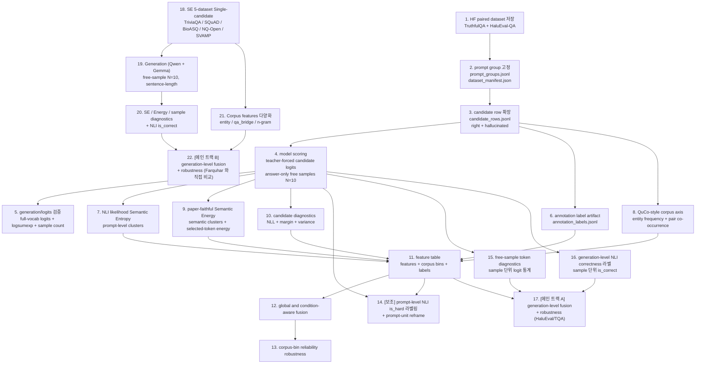

# 논문 실험 파이프라인

이 문서는 처음 보는 연구자가 같은 산출물을 다시 만들 수 있도록 고정한 실행 계약이다. 본 repo 의 **메인 트랙은 트랙 B — SE 5-dataset Single-candidate** 이다.

- **트랙 B — SE 5-dataset Single-candidate (메인)**: TriviaQA + SQuAD-1.1 + BioASQ + NQ-Open + SVAMP. Farquhar (Nature 2024) Semantic Entropy 와 동일 평가셋. Single ground-truth answer per prompt + generation-level NLI correctness. (`datasets_se.yaml`, S1'-S11', §트랙 B 참조). 본 논문 메인 평가의 source.
- **트랙 A — Paired (ARCHIVED)**: TruthfulQA + HaluEval-QA 의 (정답, 환각) 후보 쌍 분석. 본 논문 초기 시도 + prompt-level is\_hard reframe 분석에 사용했으나, generation-level NLI correctness (Phase 3) 로 pivot 한 뒤 모든 stage script 가 삭제되었다. 폐기 narrative 는 `HISTORY.md` 참조.

본 트랙은 **Full logits must be repo-owned**, **Corpus statistics must be repo-owned**, **Infini-gram-compatible count backend** 를 사용한다. 학습기는 **scikit-learn 5-fold GroupKFold(prompt_id)** 다. correctness 는 NLI 양방향 entailment 매칭이다.

검증 기준은 단순하다. **Full logits must be repo-owned**, **Corpus statistics must be repo-owned**, **Infini-gram-compatible count backend** 를 사용한다. **Elasticsearch/BM25 is used for retrieval** only, and **Elasticsearch/BM25 may be used for retrieval evidence**; count 대체물로 쓰지 않는다. heuristic 문자열 매칭, generated-answer 사후 판정, LLM-as-judge fallback 은 thesis-valid label source 가 아니다. 문서-구현 정렬은 코드 리뷰와 git diff 가 책임진다.

이 파이프라인의 연구 질문은 RAG 시스템 구축이 아니다. QuCo-RAG에서 온 entity frequency와 entity-pair co-occurrence를 **continuous corpus-support axis**로 만들고, 그 axis의 bin마다 hallucination metric reliability가 어떻게 달라지는지 검증한다.

## 1. 전체 방법론 다이어그램



## 2. 전체 실행 명령

본 트랙 (메인, **트랙 B — SE 5-dataset Single-candidate**) 은 stage 별 CLI 호출로 실행한다. 통합 orchestrator 는 의도적으로 두지 않는다 (S2'/S4'/S5'/S7' 가 GPU 점유, S1'/S3'/S8'-S10' 가 CPU/IO 라서 각 stage 가 별도 프로세스로 resumable 하게 도는 편이 안전하다). 각 stage 의 command 는 §3 트랙 B 항목 (S1'-S11') 에 그대로 적혀 있다.

dependency 설치:

```bash
uv sync --group generation
```

기본 live generation 설정은 `experiments/configs/generation_se_qwen.yaml` / `generation_se_gemma.yaml` 의 `model.model_name` / `model.tokenizer_name` 에 고정된 Qwen2.5-3B / Gemma 4 E4B-it 와 같은 계열 tokenizer 를 CUDA 에서 사용한다. 각 stage script 는 자체적으로 stdout/stderr log 와 progress checkpoint 를 산출한다 (`experiments/scripts/stage_control.py`).

## 3. 단계별 해야 할 일

### S0. 구조 검증

```bash
uv run python experiments/scripts/validate_architecture.py
```

목적: 도메인/포트/어댑터/애플리케이션 패키지 구조와 핵심 dataclass·port가 hexagonal 계약을 지키는지 확인한다. 문서-구현 정렬은 사람의 변경 검토와 코드 리뷰가 책임진다.

### S1-S13 [ARCHIVED] — 트랙 A paired pipeline

> Phase 1 (paired candidate-level) + Phase 2 (prompt-level `is_hard` proxy) 의 stage S1-S13 은
> 본 논문이 generation-level NLI correctness (Phase 3, 트랙 B) 로 pivot 한 뒤 폐기되었다.
> 관련 stage script (`prepare_datasets.py`, `build_correctness_dataset.py`,
> `compute_energy_features.py`, `build_feature_table.py`, `run_fusion.py`,
> `run_robustness.py`, `run_type_analysis.py`, `run_generation_level_analysis.py`,
> `validate_datasets.py`, `validate_energy_features.py`, `validate_type_labels.py`,
> `build_money_figure.py`, `build_manifests.py`, `inventory_artifacts.py`,
> `await_s2_then_run_downstream.sh`, `run_downstream_chain.sh`) 와 paired adapter
> (`hf_datasets.py`, `correctness_dataset.py`) 는 모두 삭제되었다. pivot 사유와
> 폐기된 단계의 narrative 는 `HISTORY.md` 참조.
>
> 본 논문 메인 평가 (트랙 B — SE 5-dataset, generation-level) 는 아래 §트랙 B 의
> S1'-S11' 만 실행한다.

<details>
<summary>이전 트랙 A stage 사양 (참조용 stub)</summary>

이전에 본 §3 가 정의했던 단계는 아래와 같다 — 모두 폐기.

```
S1. paired prompt group 및 candidate row 생성    -> 트랙 B S1' 로 대체
S2. teacher-forced candidate scoring + free samples -> S2' 가 free samples 만 산출
S3. annotation correctness label artifact          -> generation-level NLI correctness (S7') 로 대체
S4. NLI likelihood Semantic Entropy                -> 트랙 B S4' 로 대체 (script 공유)
S5. QuCo-style corpus axis                          -> 트랙 B S8' 로 대체 (script 공유)
S6. paper-faithful Semantic Energy + diagnostics   -> 트랙 B S5' (compute_energy_se_minimal.py) 로 대체
S7. feature table 결합                              -> 트랙 B S11' run_generation_se_analysis.py 가 직접 join
S8. global / condition-aware fusion                 -> 트랙 B S11' 로 흡수
S9. corpus-bin reliability + robustness             -> 트랙 B S11' 로 흡수
S10. [DELETED] prompt-level is_hard reframe (Phase 2) -> HISTORY.md 참조
S11. free-sample token diagnostics                  -> 트랙 B S6' 로 대체 (어댑터 공유)
S12. generation-level NLI correctness 라벨링        -> 트랙 B S7' 로 대체
S13. generation-level fusion + robustness (메인)    -> 트랙 B S11' (run_generation_se_analysis.py) 로 대체
```

</details>

## 트랙 B — SE 5-dataset Single-candidate (메인 평가)

본 트랙은 Farquhar (Nature 2024) Semantic Entropy 와 Ma (2025) Semantic Energy 가 사용한 평가셋과 동일한 5 datasets 위에서 generation-level 환각 탐지를 평가한다. Single ground-truth answer per prompt + post-hoc NLI correctness. **본 논문 메인 평가의 source 트랙이다.**

### S1'. 데이터셋 준비 (5 SE datasets)

```bash
uv run python experiments/scripts/prepare_datasets_se.py \
  --config experiments/configs/datasets_se.yaml \
  --out-dir experiments/results/datasets
```

- 입력: `experiments/configs/datasets_se.yaml`
- 모듈: `experiments/adapters/hf_datasets_single_candidate.py`, `experiments/scripts/prepare_datasets_se.py`
- 출력:
  - `results/datasets/prompt_groups.jsonl` — 3,500 prompts (TriviaQA 800 + SQuAD-1.1 800 + BioASQ 800 + NQ-Open 800 + SVAMP 300)
  - `results/datasets/candidate_rows.jsonl` — 3,500 single right candidate (1 per prompt)
  - `results/datasets/dataset_manifest.json`
- Prompt template (Farquhar 2024 sentence-length):
  ```
  Answer the following question in a single brief but complete sentence.
  Question: {question}
  Answer:
  ```
- Context passage 누락 (Farquhar §Methods — confabulation 유도 의도)

### S2'. Generation (free-sample N=10, 두 모델)

```bash
# 모델 A: Qwen2.5-3B
uv run python experiments/scripts/run_generation.py \
  --config experiments/configs/generation_se_qwen.yaml \
  --prompt-groups $RUN/results/datasets/prompt_groups.jsonl \
  --candidates $RUN/results/datasets/candidate_rows.jsonl \
  --out-free-samples $RUN/qwen/results/generation/free_sample_rows.json \
  --out-candidate-scores $RUN/qwen/results/generation/candidate_scores.json

# 모델 B: Gemma 4 E4B-it (publicly available)
uv run python experiments/scripts/run_generation.py \
  --config experiments/configs/generation_se_gemma.yaml \
  --prompt-groups $RUN/results/datasets/prompt_groups.jsonl \
  --candidates $RUN/results/datasets/candidate_rows.jsonl \
  --out-free-samples $RUN/gemma/results/generation/free_sample_rows.json \
  --out-candidate-scores $RUN/gemma/results/generation/candidate_scores.json
```

- 모델: Qwen2.5-3B + Google Gemma 4 E4B-it (cross-model 일반화 검증)
- Sampling: temperature=1.0, top_p=0.9, top_k=50, N=10 (Farquhar 2024 §Methods)
- max_new_tokens=64 (sentence-length 답변 충분)
- `answer_only.enabled=false` — sentence-level free-form generation
- 산출물: `$RUN/{qwen,gemma}/results/generation/free_sample_rows.json` + full vocab logits parquet sidecar

### S3'. Checkpoint consolidate (free_sample_rows.json 재조립)

```bash
uv run python experiments/scripts/consolidate_checkpoints_se.py \
  --checkpoint-dir $RUN/{qwen,gemma}/results/generation/free_sample_rows.json.checkpoint \
  --out $RUN/{qwen,gemma}/results/generation/free_sample_rows.json
```

run_generation.py 의 finalize 단계가 35,000 sample × full vocab logits parquet consolidate 로 매우 느릴 때 (Qwen 측정 약 3-5h+), checkpoint shard 들에서 sample dict 만 직접 모아 free_sample_rows.json 만든다 (~10초). full_logits 는 per-shard parquet 로 두고 sample 의 `full_logits_ref.path` 에 절대 경로 기록 → 후속 streaming (free_sample_diagnostics 의 top1-top2 margin) 에서 그대로 읽음. 빈 response_text 는 `(empty)` placeholder.

산출: `$RUN/{qwen,gemma}/results/generation/free_sample_rows.json` (35,000 sample, ~100 MB).

### S4'. Semantic Entropy

```bash
uv run python experiments/scripts/compute_semantic_entropy.py \
  --free-samples $RUN/{qwen,gemma}/results/generation/free_sample_rows.json \
  --out $RUN/{qwen,gemma}/results/semantic_entropy_features.parquet
```

기존 트랙 A 어댑터 재사용. NLI cluster + cluster log-likelihood 산출 (prompt 단위).

### S5'. Semantic Energy (paper-faithful)

```bash
uv run python experiments/scripts/compute_energy_se_minimal.py \
  --free-samples $RUN/{qwen,gemma}/results/generation/free_sample_rows.json \
  --semantic-entropy $RUN/{qwen,gemma}/results/semantic_entropy_features.parquet \
  --out $RUN/{qwen,gemma}/results/energy_features.parquet
```

본 트랙은 candidate_scores 가 없는 single-candidate 셋업이므로 트랙 A 의 `compute_energy_features.py` (candidate_scores 필수) 대신 mini script 가 free-sample + SE cluster 만으로 paper-faithful Semantic Energy (Ma 2025 Eq. 11–14) 산출.

### S6'. Free-sample diagnostics (sample-level token 통계)

```bash
uv run python -m experiments.adapters.free_sample_diagnostics --run-dir $RUN/{qwen,gemma}
```

- 입력: `$RUN/.../generation/free_sample_rows.json` + per-shard `full_logits.parquet`
- 산출 신호 (sample 단위): sample_nll / sample_sequence_log_prob / sample_logit_variance / sample_logsumexp_mean (selected token 통계) + sample_confidence_margin_{mean,min} / sample_top1_logit_mean (full vocab streaming top1-top2 추출)
- `--no-vocab-margin` 시 top1-top2 streaming skip (selected-token 통계만)

### S7'. Generation-level NLI correctness

```bash
uv run python -c "from experiments.application.generation_correctness import build_generation_correctness_frame, write_generation_correctness_artifacts; ..."
```

- free-sample $s_i$ 와 정답 후보 (alias_list) 사이의 \texttt{microsoft/deberta-large-mnli} 양방향 entailment 매칭 확률 ≥ 0.5 → `is_correct=1`.
- 산출: `generation_correctness.parquet` + `generation_correctness.audit.json`. row=(prompt_id, sample_index).
- GPU 메모리 충돌 시 `batch_size=16` 권장 (Gemma generation 과 병렬 실행 가능).

### S8'. Corpus features (entity-level)

```bash
uv run python experiments/scripts/compute_corpus_features.py \
  --candidates $RUN/results/datasets/candidate_rows.jsonl \
  --out $RUN/{qwen,gemma}/results/corpus_features.parquet \
  --entity-extractor spacy
```

- 입력: SE track candidate_rows (single right candidate per prompt)
- 어댑터: `experiments/adapters/corpus_features.py` (그대로)
- backend: `candidate_rows.jsonl.corpus_backend.json` sidecar 가 같은 디렉터리에 있어야 함 (paired track 의 backend config 복사 또는 재작성)
- 산출: entity_frequency, entity_pair_cooccurrence, axis bin 등 (트랙 A 와 동일)

### S9'. QA Bridge co-occurrence (corpus 다양화 1)

```bash
uv run python experiments/scripts/compute_qa_bridge_features.py \
  --candidates $RUN/results/datasets/candidate_rows.jsonl \
  --out $RUN/{qwen,gemma}/results/qa_bridge_features.parquet
```

- 어댑터: `experiments/adapters/qa_bridge_features.py`
- 산출: (question entity, answer entity) bridge co-occurrence — fact-level corpus support
- 신호: qa_bridge_pair_count / min / mean / axis / zero_flag

### S10'. N-gram coverage (corpus 다양화 2)

```bash
uv run python experiments/scripts/compute_ngram_coverage_features.py \
  --candidates $RUN/results/datasets/candidate_rows.jsonl \
  --out $RUN/{qwen,gemma}/results/ngram_coverage_features.parquet \
  --n 3 5
```

- 어댑터: `experiments/adapters/ngram_coverage_features.py`
- 산출: 답변 token 의 3-gram, 5-gram 의 corpus count 평균/min/zero_count/axis (Infini-gram 본래 use case)
- 신호: ans_ngram_3_axis, ans_ngram_5_axis, ans_ngram_3_zero_count, ans_ngram_5_zero_count

### S11'. Generation-level fusion + robustness (메인)

```bash
uv run python experiments/scripts/run_generation_se_analysis.py \
  --run-dir $RUN/{qwen,gemma} --bootstrap-n 1000
```

- 모듈: `experiments/application/generation_level_eval.py` (`build_generation_features` + `run_generation_fusion` + bootstrap CI + per-decile + per-dataset + calibration + AURAC)
- Fusion 입력 (CORE_INPUTS): SE / Semantic Energy (broadcast) + sample_nll / sample_logit_variance / sample_logsumexp_mean / sample_sequence_log_prob (sample-level)
- Fusion 입력 (CORPUS_INPUTS, with-corpus 변형): corpus_axis_bin_10_ord, entity_frequency_axis, entity_pair_cooccurrence_axis, entity_frequency_min, qa_bridge_axis/min/zero_flag, ans_ngram_3_axis, ans_ngram_5_axis, ans_ngram_3_zero_count, ans_ngram_5_zero_count
- Split: 5-fold GroupKFold(prompt_id)
- Metrics: AUROC, AUPRC, Brier, ECE, **AURAC** (Farquhar Nature 2024 main metric)
- 산출: `fusion.generation_level/{summary.json, predictions.jsonl}` + `robustness.generation_level/{summary, bootstrap_ci, corpus_bin_reliability, leave_one_dataset_out, threshold_calibration}.json`

### 트랙 B 산출물 체크리스트

| Artifact | 모델별 path | 역할 |
| --- | --- | --- |
| `prompt_groups.jsonl` + `candidate_rows.jsonl` | shared | 5 datasets × ~700 prompt 평균 (총 3,500 prompt) |
| `candidate_rows.jsonl.corpus_backend.json` | shared | infini-gram local backend pin (paired 트랙과 같은 v4_dolmasample_olmo) |
| `free_sample_rows.json` | `qwen/`, `gemma/` | N=10 free samples per prompt |
| `free_sample_rows.json.checkpoint/` (shard tree) | `qwen/`, `gemma/` | per-sample full_logits.parquet (consolidate 안 함) |
| `semantic_entropy_features.parquet` | `qwen/`, `gemma/` | NLI cluster + likelihood |
| `energy_features.parquet` | `qwen/`, `gemma/` | paper-faithful Semantic Energy |
| `free_sample_diagnostics.parquet` | `qwen/`, `gemma/` | sample-level token 통계 + top1-top2 margin |
| `generation_correctness.parquet` + `.audit.json` | `qwen/`, `gemma/` | NLI 양방향 entailment is_correct (per generation) |
| `corpus_features.parquet` | `qwen/`, `gemma/` | entity-level corpus signal |
| `qa_bridge_features.parquet` | `qwen/`, `gemma/` | question↔answer entity bridge cooc (corpus 다양화 1) |
| `ngram_coverage_features.parquet` | `qwen/`, `gemma/` | answer 3/5-gram corpus coverage (corpus 다양화 2) |
| `generation_features.parquet` | `qwen/`, `gemma/` | row=(pid,si), 모든 신호 join |
| `fusion.generation_level/`, `robustness.generation_level/` | `qwen/`, `gemma/` | 메인 분석 결과 (thesis 본문 source) |

## 4. 최종 산출물 체크리스트

본 논문 메인 평가 (트랙 B) 의 산출물 체크리스트는 위 §트랙 B 산출물 체크리스트 (per-model `qwen/`, `gemma/` 디렉터리 기준) 에 정의되어 있다. 폐기된 트랙 A 산출물 (`features.parquet`, `fusion/`, `robustness/`, `correctness_judgments.jsonl`, `prompt_accuracy.*`) 은 더 이상 생성되지 않는다.

논문 claim 은 트랙 B 산출물이 모두 생성되고 각 validator (S0 `validate_architecture.py`, S2' `validate_generation_logits.py`, S8' `validate_feature_provenance.py`) 가 통과한 run manifest 에서만 작성한다.

## 5. Paper-derived feature alignment

| Feature family | Source | Required implementation check |
| --- | --- | --- |
| `semantic_entropy_nli_likelihood`, `semantic_entropy_cluster_count` | Farquhar Semantic Entropy | prompt-level N=10 free samples, NLI semantic clustering, likelihood-based cluster probability distribution에서 계산해야 하며 correctness/gold 정보를 feature로 쓰지 않는다. |
| `semantic_energy_cluster_uncertainty` | Ma Semantic Energy | multiple generated answers, semantic clusters, selected-token logit-derived energy, cluster-level aggregation이 모두 있어야 paper-faithful Semantic Energy로 표기한다. |
| `semantic_energy_boltzmann_diagnostic`, `mean_negative_log_probability`, `logit_variance`, `confidence_margin` | candidate token likelihood/logit diagnostics | candidate-level diagnostic으로 명명한다. Ma Semantic Energy 공식 자체라고 쓰지 않는다. |
| `entity_frequency_axis`, `entity_frequency_min` | QuCo-RAG | Infini-gram-compatible count backend의 entity frequency semantics를 따르며 continuous corpus-support axis로 저장한다. |
| `entity_pair_cooccurrence_axis` | QuCo-RAG | `head AND tail` pair co-occurrence semantics를 따르며 relation-level corpus-support axis로 저장한다. |
| condition-aware fusion | reliability analysis framing | corpus-axis bin 또는 axis interaction term을 사용해 global fusion과 비교한다. |

## 5b. Backend, model, and protocol pins (2026-05-07)

이 섹션은 thesis-valid run에 실제로 사용된 외부 자원과 protocol 캡을 명시한다. 변경 시 본 문서와 `experiments/configs/generation.yaml`을 함께 갱신한다.

| Resource | Pinned value | Notes |
| --- | --- | --- |
| Causal LM | `Qwen/Qwen2.5-3B` (configured in `experiments/configs/generation.yaml::model`) | full-vocabulary logits sidecar dtype `float16`, vocab=151936 |
| NLI model | `microsoft/deberta-large-mnli` (default in `experiments/adapters/semantic_entropy_features.py`) | bidirectional entailment, label resolved via `config.id2label`. `--nli-model` may override per run; provenance recorded in `nli_model_ref` |
| Corpus index | Local Infini-gram `v4_dolmasample_olmo` (16B tokens) under `/mnt/data/hallucination-graduation-thesis-runs/infini-gram-indexes/v4_dolmasample_olmo/` | Free public download from `s3://infini-gram-lite/index/v4_dolmasample_olmo/` (no AWS egress). Tokenizer: `allenai/OLMo-7B-hf` (vocab=50280, eos=50279). Pair counts use `count_cnf` AND queries; the engine `approx` flag is captured in `metadata.infinigram_approx` while `provenance.approximate` is False so the upper-bound count drives the binning axis |
| Corpus backend selection | sidecar `<candidates>.corpus_backend.json` written by `experiments/scripts/setup_local_corpus_backend.py`; env var fallbacks `THESIS_CORPUS_BACKEND`, `INFINIGRAM_LOCAL_INDEX_DIR`, `INFINIGRAM_LOCAL_TOKENIZER`, `INFINIGRAM_INDEX`, `INFINIGRAM_ENDPOINT` | Live REST API (`https://api.infini-gram.io/`) is kept as fallback in `InfinigramApiBackend` but is rate-bound at ~2.85 q/s; not used as primary for full-dataset runs |
| Cache | `<candidates>.infinigram_cache.json` (schema_version `infinigram_api_cache_v1`) | Shared by API and local backends; pre-warmed via `experiments/scripts/prefetch_infinigram_counts.py` |
| Answer-only generation caps | `generation.max_new_tokens=96`, `generation.answer_only.max_answer_tokens=64`, `generation.answer_only.max_invalid_attempts=32`, `fail_on_max_new_tokens=true` | Earlier cap of 32/64/8 caused bounded resampling exhaustion on long-context HaluEval-QA prompts. New cap retains "shortest answer span" framing but accommodates compound answers; document in §method tail-prompt note. Pre-existing shards generated under the older cap remain valid (their spans ≤ 32 tokens) |
| Disk budget | `runtime.max_full_logits_parquet_gib=1200`, `runtime.min_full_logits_disk_reserve_gib=100` | `/mnt/data` budget headroom; preflight worst-case projection scales with `max_new_tokens` |

## 6. Guardrails

- No heuristic matching. String match, substring match, alias match, and normalized gold/reference match cannot create correctness labels.
- No generated-answer correctness labeling. Candidate labels come from dataset annotations before scoring.
- No LLM-as-judge fallback. A judge may be discussed only as an excluded path.
- `semantic_entropy_nli_likelihood` is prompt-level. Broadcasting it to both candidate rows in a pair is expected.
- Current exact-string N=5 SE artifacts are preliminary diagnostics, not final paper-faithful SE evidence.
- Paper-faithful Semantic Energy requires multi-generation semantic clusters and cluster-level selected-token-logit energy.
- Paper-faithful Semantic Energy requires multi-generation semantic clustering and cluster-level energy aggregation.
- Corpus axis values are not direct correctness labels.
- This experiment is not a RAG system; QuCo-RAG supplies corpus-support axis motivation only.
- Candidate-level Energy/logit diagnostics must use per-token mean length normalization.
- Corpus features are corpus-support axes and must come from direct count semantics, not retrieval scores.
- Robustness evaluation is grouped by prompt. Candidate siblings cannot be split across train/test.
- Valentin et al. 2024 (Cost-Effective Hallucination Detection)와의 차별화: Valentin의 calibration은 *내부* score attribute 조건화이고, 본 연구의 corpus axis는 *외부* corpus statistics 조건화이다. orthogonal — 두 framework는 결합 가능하지만 본 연구는 외부 axis만 다룬다.
- Simhi et al. 2025 (CHOKE)는 motivating evidence로만 인용한다 — 그쪽의 probing-based 해결책은 hidden-state probe 회피 정책에 따라 채택하지 않는다.
