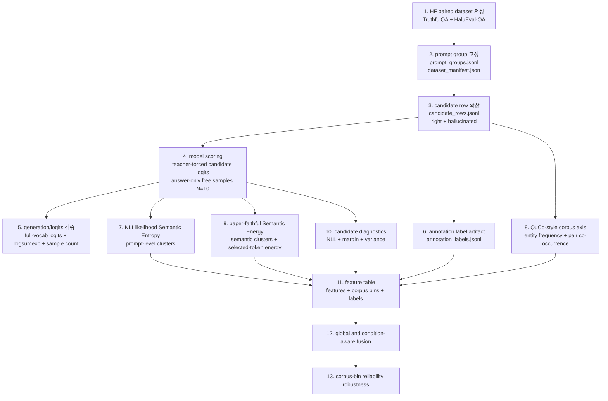

# 논문 실험 파이프라인

이 문서는 처음 보는 연구자가 같은 산출물을 다시 만들 수 있도록 고정한 실행 계약이다. 이 repo에는 논문용 **실험 데이터셋**이 하나만 있다. 실험 데이터셋은 TruthfulQA와 HaluEval-QA에서 제공되는 (정답, 환각) 후보 쌍을 prompt 단위로 정렬한 paired discriminative dataset이다.

검증 기준은 단순하다. **Full logits must be repo-owned**, **Corpus statistics must be repo-owned**, **Infini-gram-compatible count backend**를 사용한다. **Elasticsearch/BM25 is used for retrieval** only, and **Elasticsearch/BM25 may be used for retrieval evidence**; count 대체물로 쓰지 않는다. 학습기는 **custom stdlib L2 logistic regression**이다. correctness는 dataset annotation에서 직접 온다. heuristic 문자열 매칭, generated-answer 사후 판정, LLM-as-judge fallback은 thesis-valid label source가 아니다. 문서-구현 정렬은 `run_pipeline.py`와 코드 리뷰가 책임진다.

이 파이프라인의 연구 질문은 RAG 시스템 구축이 아니다. QuCo-RAG에서 온 entity frequency와 entity-pair co-occurrence를 **continuous corpus-support axis**로 만들고, 그 axis의 bin마다 hallucination metric reliability가 어떻게 달라지는지 검증한다.

## 1. 전체 방법론 다이어그램



## 2. 전체 실행 명령

manifest만 만들 때:

```bash
uv run python experiments/scripts/run_pipeline.py --dry-run --out experiments/results/runs
```

실제로 산출물을 만들 때:

```bash
uv sync --group generation
uv run python experiments/scripts/run_pipeline.py --execute --out experiments/results/runs
```

기본 live generation 설정은 `experiments/configs/generation.yaml`의 `model.model_name` / `model.tokenizer_name`에 고정된 Qwen2.5 계열 causal LM과 같은 계열 tokenizer를 CUDA에서 사용한다. `run_pipeline.py`는 stage별 command, expected input/output, validator command, planned stdout/stderr log, git commit, Python version, platform, UTC timestamp를 manifest에 저장한다. 또한 manifest top-level `script_execution_log`에 primary/validation script와 인자, command string, planned stdout/stderr log path, 실행했다면 return code를 사람이 바로 읽을 수 있는 형태로 중복 기록한다.

## 3. 단계별 해야 할 일

### S0. 구조 검증

```bash
uv run python experiments/scripts/validate_architecture.py
```

목적: 도메인/포트/어댑터/애플리케이션 패키지 구조와 핵심 dataclass·port가 hexagonal 계약을 지키는지 확인한다. 문서-구현 정렬은 사람의 변경 검토와 코드 리뷰가 책임진다.

### S1. paired prompt group 및 candidate row 생성

```bash
uv run python experiments/scripts/prepare_datasets.py --config experiments/configs/datasets.yaml --out experiments/results/datasets
```

- 입력: `experiments/configs/datasets.yaml`
- 모듈: `experiments/scripts/prepare_datasets.py`, `experiments/adapters/hf_datasets.py`
- 출력:
  - `experiments/results/datasets/prompt_groups.jsonl`
  - `experiments/results/datasets/candidate_rows.jsonl`
  - `experiments/results/datasets/dataset_manifest.json`
  - `experiments/results/datasets/dataset_preparation_report.json`

| Dataset | Prompt unit | Candidate rows | Label source |
| --- | --- | --- | --- |
| TruthfulQA | `question` | one deterministic `right` candidate and one deterministic `hallucinated` candidate per prompt | `correct_answers[]` and `incorrect_answers[]` annotation |
| HaluEval-QA | `knowledge + question` | dataset `right_answer` and `hallucinated_answer` | HaluEval-QA annotation |

`candidate_rows.jsonl` stores exactly two rows per `pair_id`: `candidate_label=right` with `is_correct=true`, and `candidate_label=hallucinated` with `is_correct=false`.

### S2. model scoring: candidate logits와 prompt free samples

```bash
uv run python experiments/scripts/run_generation.py --config experiments/configs/generation.yaml --prompt-groups experiments/results/datasets/prompt_groups.jsonl --candidates experiments/results/datasets/candidate_rows.jsonl --out-free-samples experiments/results/generation/free_sample_rows.json --out-candidate-scores experiments/results/generation/candidate_scores.json --resume
uv run python experiments/scripts/validate_generation_logits.py experiments/results/generation/free_sample_rows.json
uv run python experiments/scripts/validate_generation_logits.py experiments/results/generation/candidate_scores.json
```

- 입력: `prompt_groups.jsonl`, `candidate_rows.jsonl`, `experiments/configs/generation.yaml`
- 모듈: `experiments/scripts/run_generation.py`, `experiments/adapters/model_generation.py`
- 출력:
  - `experiments/results/generation/free_sample_rows.json`
  - `experiments/results/generation/candidate_scores.json`
- 저장 필드:
  - candidate-level teacher-forced token ids, selected token logits, per-step `logsumexp`, per-step full-vocabulary logits reference, model/tokenizer provenance
  - prompt-level answer-only free samples with `sample_index` from 0 to 9, response text, generated token ids, sequence log-likelihood, generation provenance, and full-vocabulary logits reference

모델은 candidate 답을 자유 생성하지 않는다. candidate feature는 `prompt + candidate_answer`를 teacher-forced로 scoring해서 만든다. Semantic Entropy와 paper-faithful Semantic Energy를 위해서만 prompt당 N=10 answer-only free samples를 별도로 만든다.

증분 실행 정책: 기존 N=5 artifact가 있으면 sample indexes 0--4는 보존하고 5--9만 추가 생성한다. 최종 thesis-valid artifact는 prompt마다 sample indexes `{0, 1, 2, 3, 4, 5, 6, 7, 8, 9}`가 모두 있어야 한다.

S2 validation gate: 각 candidate token position의 inline `full_logits` 또는 `full_logits_ref`가 가리키는 Parquet sidecar vector 길이가 tokenizer vocab size와 같아야 한다. top-k-only logits는 실패다. prompt free samples는 prompt별 10개 group이 모두 있어야 한다. answer-only artifact는 모든 `response_text`가 non-empty single-line answer span이어야 하며 invalid final sample rate가 0%여야 한다. generation validation은 별도 numbered stage가 아니라 S2 validator set으로 manifest에 기록한다.

### S3. annotation label artifact 생성

```bash
uv run python experiments/scripts/build_correctness_dataset.py --candidates experiments/results/datasets/candidate_rows.jsonl --out experiments/results/correctness
```

- 입력: `candidate_rows.jsonl`
- 모듈: `experiments/scripts/build_correctness_dataset.py`, `experiments/adapters/correctness_dataset.py`
- 출력:
  - `experiments/results/correctness/data/correctness_judgments.jsonl`
  - `experiments/results/correctness/dataset_manifest.json`
  - `experiments/results/correctness/README.md`

이 artifact는 공개 가능한 label-source dataset이다. correctness 정보는 label-only이며 trainable feature가 아니다.

### S4. NLI likelihood Semantic Entropy feature 생성

```bash
uv run python experiments/scripts/compute_semantic_entropy.py --free-samples experiments/results/generation/free_sample_rows.json --out experiments/results/semantic_entropy_features.parquet
```

- 입력: prompt-level N=10 free samples in `free_sample_rows.json`
- 모듈: `experiments/scripts/compute_semantic_entropy.py`, NLI clustering adapter
- 출력: `experiments/results/semantic_entropy_features.parquet`
- 계산:
  - DeBERTa-family NLI model로 sampled answer 간 entailment를 계산한다.
  - semantic equivalence는 bidirectional entailment 또는 사전 고정 relaxed entailment rule로 정의한다.
  - 각 sample의 sequence likelihood에서 cluster probability mass를 log-sum-exp로 계산한다.
  - 최종 필드는 `semantic_entropy_nli_likelihood`, `semantic_entropy_cluster_count`, `semantic_entropy_discrete_cluster_entropy`, `nli_model_ref`, `sample_log_likelihoods`, `cluster_likelihoods`를 포함한다.

SE는 prompt-level 신호다. 같은 `pair_id`에서 나온 right/hallucinated candidate row는 같은 SE를 공유한다.

### S5. QuCo-style corpus axis 생성

```bash
# 기본 (legacy regex extractor)
uv run python experiments/scripts/compute_corpus_features.py \
  --candidates experiments/results/datasets/candidate_rows.jsonl \
  --out experiments/results/corpus_features.parquet \
  --entity-extractor regex

# 권장 (QuCo-extractor-0.5B, 신규 runs 부터)
uv run python experiments/scripts/compute_corpus_features.py \
  --candidates experiments/results/datasets/candidate_rows.jsonl \
  --out experiments/results/corpus_features.parquet \
  --entity-extractor quco \
  --entity-extractor-model-ref ZhishanQ/QuCo-extractor-0.5B \
  --entity-extractor-device cuda:0

uv run python experiments/scripts/validate_feature_provenance.py experiments/results/corpus_features.parquet
```

- 입력: `candidate_rows.jsonl`
- 모듈: `experiments/scripts/compute_corpus_features.py`, corpus count adapter, entity extractor adapter (`experiments/adapters/entity_extractor_{regex,quco}.py`)
- 출력: `experiments/results/corpus_features.parquet`
- 계산:
  - candidate answer text 에서 entity 를 추출한다 — 세 backend 중 선택:
    - `spacy` (**기본, 권장**): spaCy `en_core_web_lg` NER, PERSON / ORG / GPE / LOC / DATE / EVENT / WORK_OF_ART / FAC / NORP / PRODUCT / LANGUAGE / LAW 필터. 짧은 factoid 답 (`"Delhi"`, `"1941"`) 도 NER 로 잡고, NER 누락 시 noun-chunk fallback, 그래도 비면 정규화한 텍스트 자체를 entity 로 추가 (HaluEval-QA / TruthfulQA 처럼 답이 곧 entity 인 경우 대응). CPU-only, ~1.4 ms/text.
    - `regex` (legacy, archived): 따옴표 감싼 3+ 자 / 1-4 단어 capitalized n-gram / stopword 가 아닌 5+ 자 lower-case token 후보를 정규화 + 중복 제거. 짧은 entity 누락 + 일반 명사 false positive. 새 run 에서는 사용하지 않음.
    - `quco` (실험적, archived): `ZhishanQ/QuCo-extractor-0.5B` (QuCo-RAG 공개 distilled 모델). knowledge triplet `(head, relation, tail)` 출력에서 head / tail 사용. **본 데이터셋에서 짧은 factoid 답 (`"Delhi"` 등) 의 100% 가 empty triplet → 사용하지 않음.** 어댑터는 보존.
  - Infini-gram-compatible count backend 또는 고정 corpus snapshot 에서 entity frequency 와 `head AND tail` co-occurrence 를 조회한다.
  - raw counts, log-transformed continuous axis scores, low/zero flags, bin ids, corpus provenance, **entity_extractor provenance** (`entity_extractor_version`, `entity_extractor_model_ref`, `entity_extractor_prompt_template`) 를 저장한다.

Elasticsearch / BM25 는 retrieval evidence 용도다. entity frequency 와 entity-pair co-occurrence 는 Infini-gram-compatible count backend 의 direct count semantics 를 따른다. Corpus feature 는 hallucination label 이 아니라 reliability conditioning axis 이다. Entity extractor 변경 시에는 S5 → S7 → S8 → S9 만 재실행하면 충분하다 (S2 모델 sampling / scoring, S4 NLI cluster, S6 Semantic Energy 는 entity 와 무관).

### S6. paper-faithful Semantic Energy 및 logit diagnostics 생성

```bash
uv run python experiments/scripts/compute_energy_features.py --candidate-scores experiments/results/generation/candidate_scores.json --out experiments/results/energy_features.parquet
uv run python experiments/scripts/validate_energy_features.py experiments/results/energy_features.parquet
```

- 입력: `candidate_scores.json`, `free_sample_rows.json`, `semantic_entropy_features.parquet`의 semantic cluster metadata
- 모듈: `experiments/scripts/compute_energy_features.py`, Semantic Energy adapter
- 출력: `experiments/results/energy_features.parquet`
- 계산 (paper-faithful path, Ma 2025 Eq. (11)–(14) 정확히 따름):
  1. **token energy** (Eq. 13): $\tilde E(x_t^{(i)}) = -z_\theta(x_t^{(i)})$ — selected token logit의 부호 반전.
  2. **sample energy** (Eq. 11): $E(x^{(i)}) = \frac{1}{T_i}\sum_t \tilde E(x_t^{(i)}) = \mathrm{mean}(-\text{selected\_token\_logits})$.
  3. **cluster total energy** (Eq. 12): $E_{\text{Bolt}}(C_k) = \sum_{x \in C_k} E(x)$ — cluster member sample energy의 **합 (SUM)**. cluster size가 클수록 더 큰 기여.
  4. **cluster probability** (Eq. 8): S4의 likelihood-based cluster mass $p(C_k) = \sum_{x \in C_k} \bar p(x | q)$를 그대로 상속.
  5. **final uncertainty** (paper-faithful aggregation): `semantic_energy_cluster_uncertainty = sum_k p(C_k) * E_Bolt(C_k)`. 부호 규약은 lower=more reliable.
  6. **prompt-level supplementary**: `semantic_energy_sample_energy = mean over N=10 sample energies` — Eq. (14)의 가장 단순한 collapsed reading.
- 계산 (diagnostic path, Ma paper와 별개): teacher-forced candidate token window에서 `mean_negative_log_probability`, `logit_variance`, `confidence_margin`, `semantic_energy_boltzmann_diagnostic`(token-level `-logZ` 평균) 을 candidate-level로 계산한다. 이 네 값은 paper-faithful Semantic Energy와 같은 column으로 합치지 않는다.

### S7. feature table 결합 및 axis/bin metadata 확정

```bash
uv run python experiments/scripts/build_feature_table.py --inputs experiments/results --out experiments/results/features.parquet
uv run python experiments/scripts/validate_type_labels.py experiments/results/features.parquet
```

- 입력:
  - `correctness/data/correctness_judgments.jsonl`
  - `semantic_entropy_features.parquet`
  - `corpus_features.parquet`
  - `energy_features.parquet`
- 모듈: `experiments/scripts/build_feature_table.py`, `experiments/application/labeling.py`
- 출력: `experiments/results/features.parquet`

`annotation_labels.jsonl`의 correctness는 label-only source로만 저장한다. feature table에는 prompt-level NLI SE, paper-faithful Semantic Energy, candidate-level diagnostics, candidate-level corpus axis scores, corpus bin ids, dataset/prompt/pair/candidate identities가 함께 들어간다.

### S8. global fusion 및 condition-aware fusion 평가

```bash
uv run python experiments/scripts/run_fusion.py --features experiments/results/features.parquet --config experiments/configs/fusion.yaml --out experiments/results/fusion
```

평가 대상: SE-only, Energy-only, logit-diagnostic-only, corpus-axis-only, global learned fusion without corpus axis, global learned fusion with corpus axis, corpus-bin feature selection, corpus-bin weighted fusion, axis-interaction logistic fusion.

중요: headline은 learned fusion with corpus의 aggregate AUROC 하나가 아니다. S8은 global fusion과 condition-aware fusion을 전체 및 corpus-bin별로 비교한다. 각 feature가 어떤 corpus-support bin에서 reliable한지 함께 보고해야 한다.

출력: `experiments/results/fusion/summary.json`, `experiments/results/fusion/predictions.jsonl`, condition-aware fusion artifacts.

### S9. corpus-bin reliability 및 robustness 검증

```bash
uv run python experiments/scripts/run_robustness.py --features experiments/results/features.parquet --fusion experiments/results/fusion --out experiments/results/robustness
```

검증 항목: prompt-grouped bootstrap confidence interval, leave-one-dataset-out, within-dataset checks, calibration checks, corpus-bin metric reliability, binning sensitivity, and condition-aware fusion deltas.

각 corpus-axis bin에서 AUROC, AUPRC, paired win rate, hallucinated-minus-normal delta, confidence interval을 보고한다. confidence interval이 0을 가로지르면 안정적 개선이라고 쓰지 않는다. robustness split은 prompt 단위로 묶는다. 같은 prompt에서 나온 두 candidate row가 train/test로 갈라지면 누수다.

## 4. 최종 산출물 체크리스트

| Artifact | 생성 stage | 역할 |
| --- | --- | --- |
| `prompt_groups.jsonl` | S1 | prompt-level unit, SE grouping, robustness grouping |
| `candidate_rows.jsonl` | S1 | paired right/hallucinated candidate rows |
| `dataset_manifest.json` | S1 | dataset provenance |
| `free_sample_rows.json` | S2 | prompt-level N=10 free samples for SE and Semantic Energy |
| `candidate_scores.json` | S2 | teacher-forced candidate logits and token diagnostics |
| `correctness_judgments.jsonl` | S3 | annotation-derived correctness labels |
| `semantic_entropy_features.parquet` | S4 | NLI likelihood Semantic Entropy and cluster metadata |
| `corpus_features.parquet` | S5 | corpus support axes, bins, and provenance |
| `energy_features.parquet` | S6 | paper-faithful Semantic Energy + candidate diagnostics |
| `features.parquet` | S7 | fusion input table with corpus bins |
| `fusion/summary.json` | S8 | global and condition-aware fusion results |
| `robustness/summary.json` | S9 | corpus-bin reliability and robustness results |

논문 claim은 위 산출물이 모두 생성되고 각 validator가 통과한 run manifest에서만 작성한다.

## 5. Paper-derived feature alignment

| Feature family | Source | Required implementation check |
| --- | --- | --- |
| `semantic_entropy_nli_likelihood`, `semantic_entropy_cluster_count` | Farquhar Semantic Entropy | prompt-level N=10 free samples, NLI semantic clustering, likelihood-based cluster probability distribution에서 계산해야 하며 correctness/gold 정보를 feature로 쓰지 않는다. |
| `semantic_energy_cluster_uncertainty` | Ma Semantic Energy | multiple generated answers, semantic clusters, selected-token logit-derived energy, cluster-level aggregation이 모두 있어야 paper-faithful Semantic Energy로 표기한다. |
| `semantic_energy_boltzmann_diagnostic`, `mean_negative_log_probability`, `logit_variance`, `confidence_margin` | candidate token likelihood/logit diagnostics | candidate-level diagnostic으로 명명한다. Ma Semantic Energy 공식 자체라고 쓰지 않는다. |
| `entity_frequency_axis`, `entity_frequency_min` | QuCo-RAG | Infini-gram-compatible count backend의 entity frequency semantics를 따르며 continuous corpus-support axis로 저장한다. |
| `entity_pair_cooccurrence_axis` | QuCo-RAG | `head AND tail` pair co-occurrence semantics를 따르며 relation-level corpus-support axis로 저장한다. |
| condition-aware fusion | reliability analysis framing | corpus-axis bin 또는 axis interaction term을 사용해 global fusion과 비교한다. |

## 5b. Backend, model, and protocol pins (2026-05-07)

이 섹션은 thesis-valid run에 실제로 사용된 외부 자원과 protocol 캡을 명시한다. 변경 시 본 문서와 `experiments/configs/generation.yaml`을 함께 갱신한다.

| Resource | Pinned value | Notes |
| --- | --- | --- |
| Causal LM | `Qwen/Qwen2.5-3B` (configured in `experiments/configs/generation.yaml::model`) | full-vocabulary logits sidecar dtype `float16`, vocab=151936 |
| NLI model | `microsoft/deberta-large-mnli` (default in `experiments/adapters/semantic_entropy_features.py`) | bidirectional entailment, label resolved via `config.id2label`. `--nli-model` may override per run; provenance recorded in `nli_model_ref` |
| Corpus index | Local Infini-gram `v4_dolmasample_olmo` (16B tokens) under `/mnt/data/hallucination-graduation-thesis-runs/infini-gram-indexes/v4_dolmasample_olmo/` | Free public download from `s3://infini-gram-lite/index/v4_dolmasample_olmo/` (no AWS egress). Tokenizer: `allenai/OLMo-7B-hf` (vocab=50280, eos=50279). Pair counts use `count_cnf` AND queries; the engine `approx` flag is captured in `metadata.infinigram_approx` while `provenance.approximate` is False so the upper-bound count drives the binning axis |
| Corpus backend selection | sidecar `<candidates>.corpus_backend.json` written by `experiments/scripts/setup_local_corpus_backend.py`; env var fallbacks `THESIS_CORPUS_BACKEND`, `INFINIGRAM_LOCAL_INDEX_DIR`, `INFINIGRAM_LOCAL_TOKENIZER`, `INFINIGRAM_INDEX`, `INFINIGRAM_ENDPOINT` | Live REST API (`https://api.infini-gram.io/`) is kept as fallback in `InfinigramApiBackend` but is rate-bound at ~2.85 q/s; not used as primary for full-dataset runs |
| Cache | `<candidates>.infinigram_cache.json` (schema_version `infinigram_api_cache_v1`) | Shared by API and local backends; pre-warmed via `experiments/scripts/prefetch_infinigram_counts.py` |
| Answer-only generation caps | `generation.max_new_tokens=96`, `generation.answer_only.max_answer_tokens=64`, `generation.answer_only.max_invalid_attempts=32`, `fail_on_max_new_tokens=true` | Earlier cap of 32/64/8 caused bounded resampling exhaustion on long-context HaluEval-QA prompts. New cap retains "shortest answer span" framing but accommodates compound answers; document in §method tail-prompt note. Pre-existing shards generated under the older cap remain valid (their spans ≤ 32 tokens) |
| Disk budget | `runtime.max_full_logits_parquet_gib=1200`, `runtime.min_full_logits_disk_reserve_gib=100` | `/mnt/data` budget headroom; preflight worst-case projection scales with `max_new_tokens` |

## 6. Guardrails

- No heuristic matching. String match, substring match, alias match, and normalized gold/reference match cannot create correctness labels.
- No generated-answer correctness labeling. Candidate labels come from dataset annotations before scoring.
- No LLM-as-judge fallback. A judge may be discussed only as an excluded path.
- `semantic_entropy_nli_likelihood` is prompt-level. Broadcasting it to both candidate rows in a pair is expected.
- Current exact-string N=5 SE artifacts are preliminary diagnostics, not final paper-faithful SE evidence.
- Paper-faithful Semantic Energy requires multi-generation semantic clusters and cluster-level selected-token-logit energy.
- Paper-faithful Semantic Energy requires multi-generation semantic clustering and cluster-level energy aggregation.
- Corpus axis values are not direct correctness labels.
- This experiment is not a RAG system; QuCo-RAG supplies corpus-support axis motivation only.
- Candidate-level Energy/logit diagnostics must use per-token mean length normalization.
- Corpus features are corpus-support axes and must come from direct count semantics, not retrieval scores.
- Robustness evaluation is grouped by prompt. Candidate siblings cannot be split across train/test.
- Valentin et al. 2024 (Cost-Effective Hallucination Detection)와의 차별화: Valentin의 calibration은 *내부* score attribute 조건화이고, 본 연구의 corpus axis는 *외부* corpus statistics 조건화이다. orthogonal — 두 framework는 결합 가능하지만 본 연구는 외부 axis만 다룬다.
- Simhi et al. 2025 (CHOKE)는 motivating evidence로만 인용한다 — 그쪽의 probing-based 해결책은 hidden-state probe 회피 정책에 따라 채택하지 않는다.
